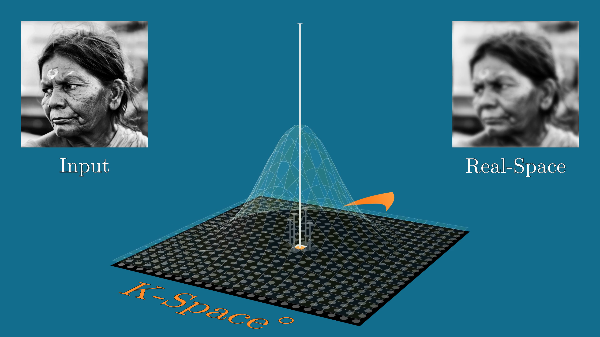
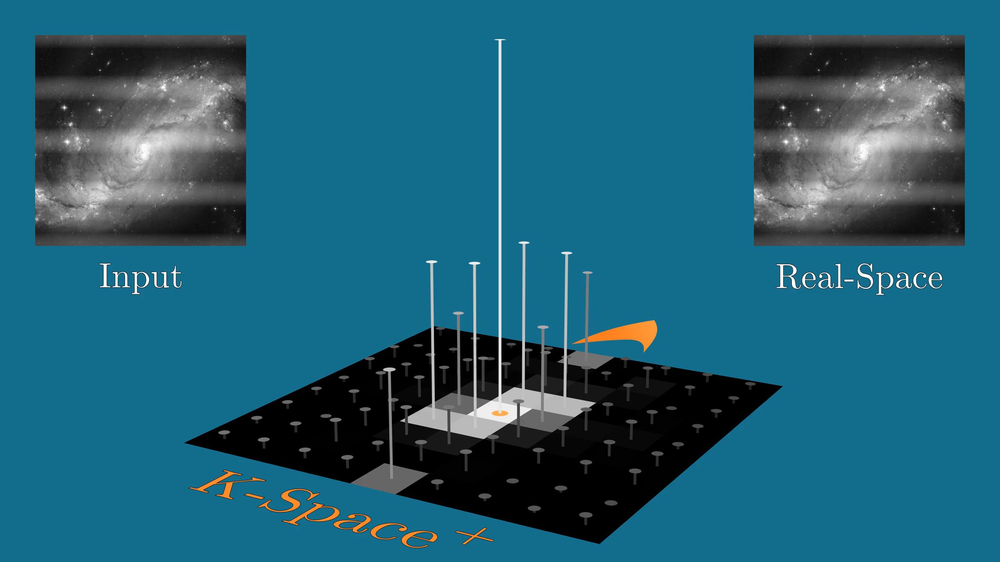

# Image Processing with manim
This Fork is for Image Processing purpose.
See the following examples, the code is [here](hendrik_old/Image_Processing/FourierIdea).
Best script to get started is:
`a_example.py`

Enjoy!
